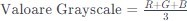
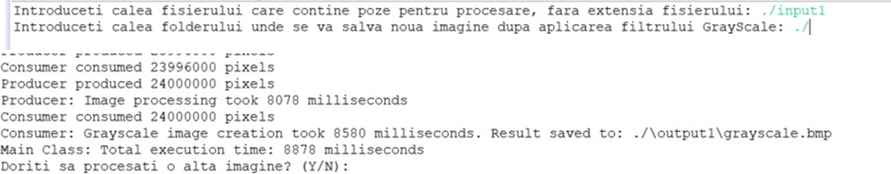
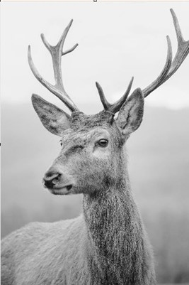
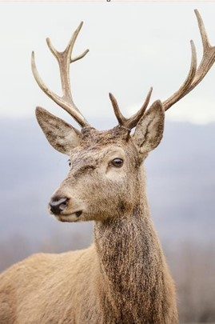
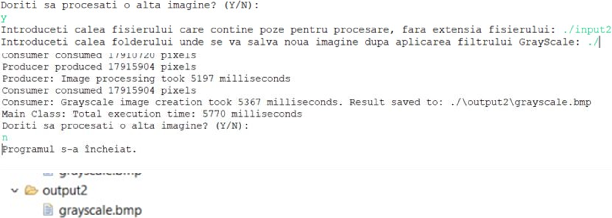
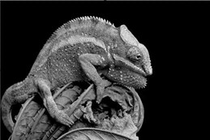
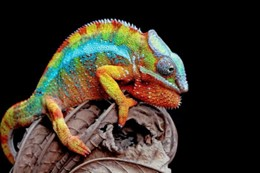

#  Proiect Java: Procesare de imagini
 
## Convertirea unei imagini color în imagine grayscale – Metoda mediei
 
**Autor:** Chiriță Andreea  

 
---
 
## Cuprins
 
- [Introducere](#introducere)
- [Descrierea aplicației cerute](#descrierea-aplicației-cerute)
- [Partea teoretică](#partea-teoretică)
- [Descrierea structurală – arhitecturală](#descrierea-structurală-–-arhitecturală)
- [Descrierea implementării](#descrierea-implementării)
- [Evaluare Performanțe](#evaluare-performanțe)
- [Cod Sursă](#cod-sursă)
- [Concluzii](#concluzii)
- [Bibliografie](#bibliografie)
 
---
 
## Introducere
 
În cadrul acestui proiect am dezvoltat o aplicație Java dedicată conversiei eficiente a imaginilor color în imagini grayscale folosind metoda mediei.
 
## Descrierea aplicației cerute
 
**Scopul Aplicației:**
 
Această aplicație are ca scop conversia unei imagini color la o versiune în tonuri de gri, utilizând metoda mediei.
 
**Funcționalități Principale:**
 
- Conversia de imagini color la imagini grayscale folosind metoda mediei.
- Interacțiune simplă cu utilizatorul pentru specificarea căilor imaginilor de intrare și de ieșire.
- Monitorizarea timpului de execuție pentru evaluarea performanțelor algoritmului.
- Implementarea modelului de execuție producător-consumator pentru gestionarea eficientă a pixelilor imaginii.
 
## Partea teoretică
 
**Metoda Mediei pentru Imagine Grayscale**
 
Metoda medie reprezintă o tehnic a de conversie a unei imagini color in una în tonuri de gri.
Această metodă se bazează pe principiul fundamental al imaginilor color, care sunt compuse din trei canale principale: roșu (R), verde (G), și albastru (B), adesea cunoscute sub denumirea de modelul RGB.
În cadrul acestei metode, pentru fiecare pixel al imaginii color, se calculează valoarea medie a celor trei canale de culoare. Procesul constă în adunarea valorilor corespunzătoare ale canalelor R, G și B, iar rezultatul obținut este împărțit la 3.

 

## Descrierea structurală – arhitecturală
 
Proiectul va fi organizat în clase și pachete distincte pentru a îndeplini cerințele de ierarhie și nivele multiple de moștenire.
 
**Nivele de moștenire:**
 
- **Color** (Interfață) 
    - Este interfața de bază pentru componente de culoare.
- **RgbColorComponent** (Clasă)
    - Implementează: Color.
    - Definește comportamentul pentru componente RGB (roșu, verde, albastru) și furnizează metode pentru manipularea acestora.

- **GrayScaleConverterAbstract** (Clasă Abstractă)
    - Moștenește: RgbColorComponent.
    - Clasă abstractă care adaugă o metodă abstractă pentru conversia la tonuri de gri.

- **GrayScalePixel** (Clasă)
    - Moștenește:GrayScaleConverterAbstract
    - Implementează conversia unui pixel la tonuri de gri și conține constructori pentru inițializarea pixelilor cu componente RGB sau cu un singur număr întreg.

- **Image** (Clasă)
    - Moștenește: Nicio clasă.
    - Reprezintă o imagine și gestionează matricea de pixeli. Implementează metode pentru manipularea și setarea pixelilor, precum și pentru gestionarea sincronizată a producătorului și consumatorului.

- **Producer** (Clasă)
    - Moștenește: Thread.
    - Extinde clasa Thread pentru a permite rularea pe un fir de execuție separat. Se ocupă de producerea pixelilor

- **Consumer** (Clasă)
    - Moștenește: Thread
    - Extinde clasa Thread pentru a permite rularea pe un fir de execuție separat. Se ocupă de consumarea pixelilor, conversia lor la tonuri de gri și salvarea rezultatului în fișiere separate.

## Descrierea implementării
 
Detalii despre implementarea claselor și interacțiunea dintre acestea, incluzând metode și variabile importante.

### packWork (Pachetul Pentru clase)

#### Clasa Image
Această clasă este responsabilă pentru gestionarea imaginilor și pixelilor.

##### Variabile de clasă:
- `pixelMatrix`: O matrice de obiecte GrayScalePixel reprezentând pixelii imaginii.
- `width` și `height`: Dimensiunile imaginii.
- `completedPixelsCount`: Numărul de pixeli care au fost procesați complet.
- `isAvailable`: Un indicator care arată dacă sunt disponibili pixeli pentru consum.
- `imageCount`: Un număr total de imagini create (variabilă statică).

##### Constructori:
- `Image()`: Inițializează o imagine cu dimensiuni implicite de 1x1.
- `Image(int width, int height)`: Inițializează o imagine cu dimensiunile specificate.

##### Blocuri de Inițializare:
- Blocul static este executat atunci când clasa este încărcată și afișează un mesaj despre crearea imaginii.
- Blocul de instanță este executat la crearea fiecărui obiect de tip Image și afișează un mesaj despre crearea unui obiect de imagine.

##### Metode principale:
- `getPixel(int i, int j)`: Această metodă primește coordonatele unui pixel și returnează obiectul GrayScalePixel asociat acestor coordonate din matricea imaginii. Dacă coordonatele sunt în afara limitelor imaginii, metoda aruncă o excepție de tip ArrayIndexOutOfBoundsException.
- `setPixel(int i, int j, GrayScalePixel p)`: Această metodă primește coordonatele unui pixel și un obiect GrayScalePixel și setează acel pixel la coordonatele specificate în matricea imaginii. Dacă coordonatele sunt în afara limitelor imaginii, metoda aruncă o excepție de tip ArrayIndexOutOfBoundsException.
- `getWidth()`: Returnează lățimea imaginii.
- `getHeight()`: Returnează înălțimea imaginii.
- `setSize(int width, int height)`: Această metodă primește noi dimensiuni pentru imagine și reinițializează matricea de pixeli conform noilor dimensiuni.
- Metode sincronizate pentru producător și consumator: Aceste metode sunt sincronizate pentru a asigura o gestionare corectă și sigură a matricei și a numărului de pixeli produși și consumați. Aceste metode sunt utilizate în implementarea modelului producător-consumator.
  - `setProducedPixel(int i, int j, GrayScalePixel p)`: Această metodă este apelată de producător pentru a seta pixelul la coordonatele specificate și a actualiza numărul de pixeli produși.
  - `getConsumedPixel(int i, int j)`: Această metodă este apelată de consumator pentru a obține pixelul de la coordonatele specificate și a actualiza numărul de pixeli consumați.
- `checkBounds(int i, int j)`: Această metodă verifică dacă coordonatele specificate sunt în limitele imaginii. Dacă nu sunt, metoda aruncă o excepție de tip ArrayIndexOutOfBoundsException.
- `waitForAvailability(boolean expected)`: Această metodă așteaptă până când imaginea devine disponibilă sau indisponibilă, în funcție de valoarea așteptată (expected).
- `handleProducer(int i, int j, GrayScalePixel p, String role)`: Gestionează producția unui pixel.
- `handleConsumer(int i, int j, String role)`: Gestionează consumul unui pixel.
- `handleCompletion(String role, int i, int j)`: Gestionează finalizarea unei linii de pixeli.
- `updatePixelAndCount(int i, int j, GrayScalePixel p, boolean isProducer, String role)`: Actualizează matricea și numărul de pixeli în funcție de tipul de operație (producție sau consum).

#### Interfața Color
Specificarea metodelor pentru gestionarea culorilor.

- `setRed(int r)`: Setează componenta roșie a culorii.
- `getRed()`: Obține valoarea componentei roșii a culorii.
- `setGreen(int g)`: Setează componenta verde a culorii.
- `getGreen()`: Obține valoarea componentei verzi a culorii.
- `setBlue(int b)`: Setează componenta albastră a culorii.
- `getBlue()`: Obține valoarea componentei albastre a culorii.

#### Clasa RgbColorComponent
Această clasă implementează interfața Color și definește comportamentul pentru componente RGB (roșu, verde, albastru).

##### Variabile de instanță:
- `red`, `green`, `blue`: Componentele RGB.

##### Metode:
- `setRed(int red)`: Setează valoarea componentei roșii. Valoarea este validată folosind metoda privată `validateColorValue`.
- `setGreen(int green)`: Setează valoarea componentei verzi. Valoarea este validată folosind metoda privată `validateColorValue`.
- `setBlue(int blue)`: Setează valoarea componentei albastre. Valoarea este validată folosind metoda privată `validateColorValue`.
- `getRed(): int`: Returnează valoarea componentei roșii.
- `getGreen(): int`: Returnează valoarea componentei verzi.
- `getBlue(): int`: Returnează valoarea componentei albastre.
- `validateColorValue(int value): int`:
  - Validează o valoare pentru o componentă de culoare (roșu, verde, albastru).
  - Dacă valoarea este mai mică decât 0, returnează 0.
  - Dacă valoarea este mai mare decât 255, returnează 255.
  - În caz contrar, returnează valoarea inițială.

#### Clasa GrayScaleConverterAbstract
Clasă abstractă care adaugă o metodă abstractă pentru conversia la tonuri de gri.

##### Metoda abstractă:
- `public abstract void convertToGray()`: Metodă abstractă pentru conversia la tonuri de gri.

#### Clasa GrayScalePixel

Clasa GrayScalePixel reprezintă un pixel în tonuri de gri.

##### Constructori
- `public GrayScalePixel(int red, int green, int blue)`: Inițializează un pixel cu componente RGB specific folosind metodele implementate în `RgbColorComponent`.
- `public GrayScalePixel(int pixel)`: Inițializează un pixel pe baza unui număr întreg care reprezintă valorile RGB combinate.

##### Metode
- `public void convertToGray()`: Convertește pixelul la nuanță de gri prin calcularea valorii medii a componentelor și setarea acestora la valoarea medie. Implementarea metodei abstracte din clasa pe care o extinde: Clasa `GrayScaleConverterAbstract`.

#### Clasa Producer

Clasa Producer extinde clasa Thread pentru a permite rularea pe un fir de execuție separat. Aceasta se ocupă de procesul de producere a pixelilor dintr-un fișier imagine și introducerea lor într-un obiect de tip Image.

##### Variabile de Instanță
- `Image img`: Referință către obiectul Image care va fi populat cu pixeli din imaginea sursă.
- `String filePath`: Calea către fișierul imagine sursă.
- `BufferedImage fileImg`: Obiect BufferedImage pentru citirea imaginii sursă din fișier.
- `File file`: Reprezentarea fișierului imagine sursă.

##### Constructor
- `public Producer(Image img, String filePath)`: Inițializează obiectul Producer cu o referință la obiectul Image și calea către fișierul imagine sursă. Adaugă extensia BMP la calea fișierului și inițializează imaginea din fișier.

##### Metode
- `public void run()`: Metodă care va fi executată atunci când firul de execuție al Producer este lansat. Măsoară timpul de început și sfârșit al procesării imaginii și afișează durata procesării imaginii în milisecunde.
- `private void initializeImageFromFile()`: Metodă privată pentru inițializarea imaginii din fișier. Încearcă să citească imaginea sursă într-un obiect BufferedImage și setează dimensiunile imaginii în obiectul Image.
- `private void processImagePixels()`: Metodă privată pentru procesarea pixelilor imaginii. Iterează prin fiecare pixel al imaginii și îl setează în obiectul Image, introducând o pauză simulată între citirea segmentelor de informație.

#### Clasa Consumer

Clasa Consumer extinde clasa Thread și este responsabilă pentru procesul de consumare a pixelilor dintr-un obiect Image, convertirea acestora la tonuri de gri și salvarea rezultatului sub formă de imagine grayscale într-un fișier.

##### Variabile de Instanță
- `static int counter = 1`: Contor pentru a număra consumatorii și a crea nume unice pentru fișierele rezultate.
- `Image img`: Referință către obiectul Image din care se vor consuma pixeli.
- `String pathout`: Calea către directorul unde vor fi salvate fișierele rezultate.

##### Constructor
- `public Consumer(Image img, String pathout)`: Inițializează obiectul Consumer cu o referință la obiectul Image și calea către directorul de ieșire.

##### Metode
- `public void run()`: Metodă care va fi executată atunci când firul de execuție al Consumer este lansat. Generează un nume unic pentru fișierul rezultat, construiește calea către fișierul rezultat, creează un obiect BufferedImage pentru a salva rezultatul, iterează prin fiecare pixel al imaginii de intrare, îl convertește la tonuri de gri și actualizează imaginea rezultat, salvează imaginea rezultat într-un fișier BMP, afișează durata procesării și calea fișierului rezultat.
- Pentru a evita conflictele la accesarea variabilei counter între mai mulți consumatori, operațiunile care modifică acest contor sunt sincronizate (synchronized (Consumer.class)).

---

### Pachetul pentru testare (packTest)

#### Clasa MyMain

Clasa MyMain servește drept clasă principală (entry point) a programului și gestionează procesul de citire de la tastatură, creare a obiectelor Image, Producer și Consumer, lansare a firelor de execuție, măsurare a timpului de execuție și repetare a procesului pentru mai multe imagini.

- Se utilizează un obiect BufferedReader pentru citirea de la tastatură. System.in reprezintă intrarea standard (tastatura).
- Există un bloc while care se execută atâta timp cât processAnotherImage este true.
- În cadrul blocului try-catch, utilizatorul este solicitat să introducă calea către fișierul imaginii și calea către folderul unde va fi salvată noua imagine.
- Se creează un obiect Image pentru a reprezenta imaginea.
- Se măsoară timpul de execuție începând de la crearea obiectului Image.
- Se creează și se pornesc firele de execuție Producer și Consumer.
- Firele de execuție sunt pornite în fire de execuție distincte (start()).
- Programul așteaptă terminarea firelor de execuție cu join().
- Se măsoară timpul total de execuție.
- Utilizatorul este întrebat dacă dorește să proceseze o altă imagine, iar processAnotherImage este actualizat în funcție de răspuns.
- După încheierea procesului, obiectul BufferedReader este închis pentru a evita scurgeri de resurse.
- Se afișează un mesaj la încheierea programului.

 
## Evaluare Performanțe
 
Analiza performanței aplicației prin monitorizarea timpului de execuție și eficiența conversiei imaginilor.

 

 

## Concluzii
 
Proiectul demonstrează eficiența și modularitatea unei implementări care utilizează modelul producător-consumator pentru procesarea imaginilor, evidențiind importanța sincronizării și gestionării eficiente a resurselor în programele multithreaded.

- **Procesare Imagini Paralelă:** Implementarea evidențiază abordarea procesării paralele a imaginilor, folosind producători și consumatori pentru a manipula pixelii imaginii în mod eficient pe fire de execuție separate.

- **Sincronizare și Comunicare:** Sincronizarea corectă a operațiilor asupra datelor partajate (pixelMatrix) și comunicarea între producător și consumator sunt gestionate eficient pentru a evita conflictele și pentru a menține coerența datelor.

- **Interacțiunea cu Utilizatorul:** Utilizatorul interacționează prin introducerea căilor către fișierele de intrare și ieșire, permițând astfel procesarea mai multor imagini într-un mod consecutiv.

- **Utilizarea Interfețelor și Claselor Abstracte:** Se utilizează interfețe și clase abstracte pentru a defini și implementa comportamente specifice legate de culori, facilitând astfel modularitatea codului.

- **Manipularea Excepțiilor:** Gestionarea excepțiilor, în special cele legate de citirea și scrierea fișierelor de imagine, este inclusă în cod pentru a asigura o execuție robustă și pentru a furniza informații utile în caz de erori.

- **Măsurarea Performanței:** Se măsoară timpul de execuție al procesării imaginilor, oferind utilizatorului informații despre performanța programului.

- **Structura OOP (Programare Orientată pe Obiecte):** Implementarea respectă principiile OOP, utilizând clase, obiecte, moștenire, incapsulare și polimorfism pentru a organiza și structura codul într-un mod clar și modular.

 
## Bibliografie
 
- Suport Curs AWJ. (2023-2024).
- Dyclassroom. "How to convert a color image into grayscale image in Java." [Link](https://dyclassroom.com/image-processing-project/how-to-convert-a-color-image-into-grayscale-image-in-java)
- geeksforgeeks. "Image Processing in Java – Colored Image to Grayscale Image Conversion." [Link](https://www.geeksforgeeks.org/image-processing-in-java-colored-image-to-grayscale-image-conversion/)